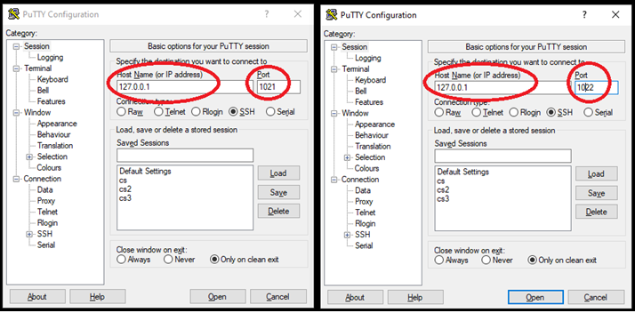

# vbox-port-forward

In this demo, we are going to build virtual machines by using VirtualBox. We will also set static IP and hostname for our VMs. 

To enable "remote" access to our VMs under NAT network, this demo will show us how to set port forward rules, so that we can use Putty or VS Code on the host to access the guests.

### 1. Create a virtual machine with Ubuntu Server

Here we can create virtual machines with the same Linux distribution as our AWS EC2 instances: Ubutnu 22.04 (not the current LTS, but the previous one, with better community support).

You can [download it here](https://releases.ubuntu.com/jammy/ubuntu-22.04.5-live-server-amd64.iso).

Then create a VM by [following the instruction here](https://www.virtualbox.org/manual/ch01.html#create-vm-wizard).

Select the Ubuntu Server ISO image you just downloaded. VirtualBox can detect the Linux distribution of the guest image of Ubuntu Server 22.04 during this installation.

**Please note**: select "skip unattended installation". The current version of VirtualBox is 7.1.6, which is not equipted with a sophisticated feature of unattended installation for Ubuntu 22.04 server.

During the installation of Ubuntu Server, you will see interfaces for your language, keyboard layout, network connection, proxy address, mirror address, disk configuration, etc. You can just select "Done" by using keyboard "Tab", "Up", "Down" and "Enter". Then "Continue" in the dialog prompt to finish the disk configuration.

After that, type in your basic account info, e.g., server's name, username and password. Then select "Install OpenSSH Server", and leave other software unselected, and "Done".

#### (a) Linux Commands

First, we need to get use to common Linux commands. Please reference [this link](https://linuxconfig.org/linux-commands-cheat-sheet).

And sometimes, we may accidentally give some special commands from the keyboard (e.g., accidentally press ctrl + s in the command line and then can't type in anything, then you need ctrl + q), so the Bash keyboard shortcuts are also important: [link 1](https://ss64.com/bash/syntax-keyboard.html), and [link 2](https://www.enlinux.com/bash-keyboard-shortcuts/).


#### (b) Vim Editor

A vim editor could be very useful. You can install it by the following command in the terminal of the guest (ctrl+alt+t):

```bash
sudo apt install vim -y
```

And here is [a quick start guide for vim](https://opensource.com/article/19/3/getting-started-vim).


#### (c) Static IP and new Hostname

Then, to config the static IP, please follow [this document](https://ubuntu.com/server/docs/network-configuration).


There are some useful commands in this article (make changes based on your system environment, if it's different):

| Commands | Explanations |
|----------|--------------|
| `ip a` | Display available Ethernet interfaces. The one with information like "inet 10.0.***.***" should be our target interface, e.g., enp0s3. |
| `ip address show dev enp0s3` | Verify the IP configuration: the IP is like 10.0.***.*** and the state is UP. |
| `ip route show` | Verify your default gateway configuration: there is some information like "default via 10.0.2.2". And this can be used later. |
| `ls /etc/netplan/` | Help to identify the netplan configuration file. You may find it similar as "/etc/netplan/00-installer-config.yaml". |
| `sudo cp /etc/netplan/00-installer-config.yaml /etc/netplan/00-installer-config.yaml.copy` | It's a good idea to create a copy before making the change |
| `sudo vim /etc/netplan/00-installer-config.yaml` | Edit the netplan configuration. Its content can be configured as [the included yaml file](00-installer-config.yaml). |
| `sudo netplan apply` | Apply the configured netplan. |
| `ip a` | Verify the IP is changed |
| `ping google.com` | Verify the outgoing network traffic |
| `sudo vim /etc/cloud/cloud.cfg.d/99-disable-network-config.cfg` | Add this: `network: {config: disabled}` This is used to disable cloud-init networking, which can reset the networking config (e.g., back to hdcp) on reboot based on a datasource. |

Please make necessary changes based on your specific case. This means some of the commands above need to be modified accordingly.

In the netplan configuration file, please pay attention to the indentation. Typically, the indentation can be directly maintained by the editor, if you type in the contents manually, instead of copy and paste.

### 2. Clone a VM
Once the first VM is created, we can clone it for future VMs. We can follow [the instructions here](https://www.virtualbox.org/manual/ch01.html#clone).

You can select "Generate New MAC Addresses For All Network Adapters" in the MAC Address Policy, and "Full clone" in Clone type.

Once this is done, please **change the hostname and static IP**, by similar manner as **Step 1** above.

### 3. Channel the network connection between VMs.

By default, the network mode for these VMs is NAT (Network Address Translation) and the traffic between VMs is not supported. We need to change the mode to NAT Network.

You can go to VirtualBox Manager, and find File -> Tools -> Network Manager: then under NAT Networks tab, click the Create button. The name for the new NAT Network should be similar as "NatNetwork", with some IPv4 and IPv6 Prefix.

For each VM, go to Settings, select Network. And for your enabled adapter, select "NAT Network" in "Attached to", with the new Name of NAT Network (e.g., "NatNetwork") created above. Click "OK" to finish.

### 4. Set Port Forwarding

You can download PuTTY at:
https://www.chiark.greenend.org.uk/~sgtatham/putty/latest.html

The installation is straightforward. You need to remember its installation location, to launch it later.

Now let's enable remote access for VMs under NAT Network mode. We need to set port forwarding for both VMs. On your host, open your command prompt, and try the following commands:

```bash
vboxmanage natnetwork modify --netname NatNetwork --port-forward-4 "ssh1:tcp:[]:1021:[10.0.2.101]:22"
```

The netname is the name of the NAT Network you created in Step 1 above, by default this is NatNetwork.

The rule here is named "ssh1", and you can change it as you wish, as long as it's unique. 1021 is a port you can determine, and it can be channeled with port 22 in guest VM1 with IP 10.0.2.101. Port 22 is the default port of ssh access. By this rule, access to our host through port 1021 will be directed to port 22 on the guest.

Then you can do a similar job for VM2:

```bash
vboxmanage natnetwork modify --netname NatNetwork --port-forward-4 "ssh2:tcp:[]:1022:[10.0.2.102]:22"
```

This is a similar rule for VM2. You can change the name or IP as needed.

Then we can open two instances of PuTTY to connect to our VMs:


### 5. Disable DHCP in VirtualBox

You can go to VirtualBox Manager, and find File -> Tools -> Network Manager: then under NAT Networks tab, General Options, uncheck `Enable DHCP`, and apply.
